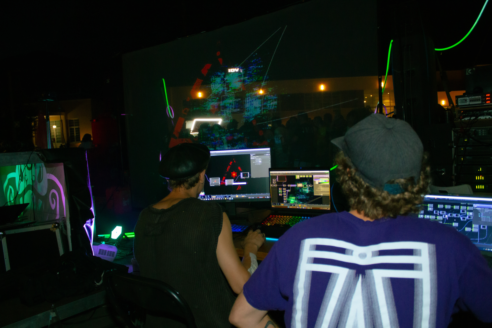

  

  <strong>Somewhere between logic and instinct.</strong> 
  Software engineering · Interactive systems · Creative technology

 

  
   
  Behind the scenes. Where code becomes an experience.

 

## From an idea to something real

I’m Elias. I build things where **code, design, and the physical world** meet.

Sometimes that means software, interfaces, and reusable tools. Sometimes it
means programming a controller, shaping a visual, or making a space respond
to music.

I enjoy understanding how a system works — and deciding how it should feel.

## What draws me in

**Software & interfaces**  
Clear interactions, useful tools, and systems that make complex things approachable.

**Hardware & control**  
Electronics, embedded systems, and getting software to do something in the real world.

**Light & sound**  
Real-time visuals, lighting, music, and the moments when separate elements become one experience.

## Tools I reach for

`Python` · `TypeScript / JavaScript` · `React` · `C++`

`TouchDesigner` · `Blender` · `Embedded development`

---

  Support the next experiment.
    
  

  <a href="https://github.com/etleli">GitHub</a>
  &nbsp; / &nbsp;
  <a href="https://www.npmjs.com/~etleli">npm</a>

